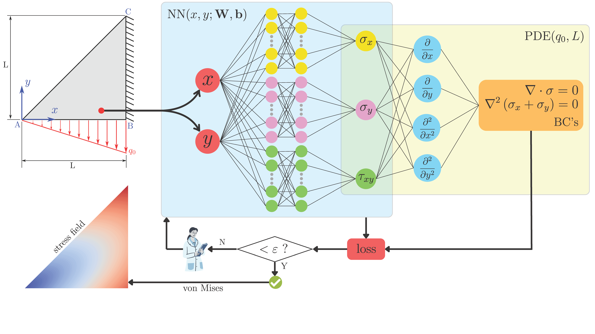

## ElasticityPINN



This repository serves as a comprehensive tutorial on introducing PINNs to solve elasticity problems. It demonstrates how PINNs can predict stress distribution solely based on the physical laws of elasticity theory.

### Table of Contents
- [Overview](#overview)
- [Usage](#usage)
- [Documentation](#documentation)
- [Authors](#authors)
- [Citing ElasticityPINN](#citing-elasticitypinn)
- [License](#license)
- [Institutional support](#institutional-support)
- [Funding](#funding)
- [Contact](#contact)

### Overview
> [!NOTE]
> [**ElasticityPINN**](ElasticityPINN.ipynb) is a computational framework developed to solve two-dimensional elasticity problems using **Physics-Informed Neural Networks (PINNs)**. Instead of relying on conventional meshing techniques from the Finite Element Method (FEM), this approach embeds the governing equations and boundary conditions directly into the neural network’s loss function. The repository contains a reproducible notebook that demonstrate this methodology through a classical benchmark case — **triangular plate under a vertical distributed load**, where the PINN accurately predicts the stress field without using any analytical or FEM data for training. This case serves as an introductory example of how PINNs can generate physics-consistent stress distributions in solid mechanics problems. 


### Usage
To get started with [**ElasticityPINN**](ElasticityPINN.ipynb), follow these steps:
1. Clone the repository:
   ```bash
   git clone https://github.com/estevaofuzaro98/ElasticityPINN.git
   ```
2. Navigate to the package directory:
   ```bash
   cd ElasticityPINN
   ```

### Documentation
The main routine was coded in `Python Notebook` and provides a step-by-step implementation of the PINN formulation, including the definition of the governing equations, boundary conditions, and loss function components. Each section is thoroughly commented to ensure reproducibility and facilitate adaptation to new elasticity problems.

### Authors
- Estevão Fuzaro de Almeida (FEIS/UNESP)
- Samuel da Silva (FEIS/UNESP)

### Citing ElasticityPINN
> [!IMPORTANT] 
> If you use [**ElasticityPINN**](ElasticityPINN.ipynb) in your research, please cite the following publications:
> - E. F. Almeida and S. da Silva, *Some Regards on using Physics-Informed Neural Networks for Solving Two-Dimensional Elasticity Problems*, **Journal of the Brazilian Society of Mechanical Sciences and Engineering**, 2025 [DOI: 10.1007/s40430-025-06047-1](https://link.springer.com/article/10.1007/s40430-025-06047-1)
> - E. F. Almeida, S. da Silva and A. Cunha Jr, *Physics-Informed Neural Networks for Solving Elasticity Problems*, in: **27th International Congress on Mechanical Engineering (COBEM 2023)**, 2023 [DOI: 10.26678/ABCM.COBEM2023.COB2023-0310](https://doi.org/10.26678/ABCM.COBEM2023.COB2023-0310)
>    - ResearchGate: [Physics-Informed Neural Networks for Solving Elasticity Problems](https://www.researchgate.net/publication/377153272_Physics-informed_neural_networks_for_solving_elasticity_problems)
>   
> ```
> @article{FuzarodeAlmeida2025,
>    author  = {Fuzaro de Almeida,  Estevão and da Silva,  Samuel},
>    title   = {Some Regards on using Physics-Informed Neural Networks for Solving Two-Dimensional Elasticity Problems},
>    year    = {2025},
>    journal = {Journal of the Brazilian Society of Mechanical Sciences and Engineering},
>    DOI     = {10.1007/s40430-025-06047-1},
> }
> 
> @inproceedings{FuzarodeAlmeida2023,
>   series     = {COB2023},
>   title      = {PHYSICS-INFORMED NEURAL NETWORKS FOR SOLVING ELASTICITY PROBLEMS},
>   url        = {http://dx.doi.org/10.26678/ABCM.COBEM2023.COB2023-0310},
>   DOI        = {10.26678/abcm.cobem2023.cob2023-0310},
>   booktitle  = {Proceedings of the 27th International Congress of Mechanical Engineering},
>   publisher  = {ABCM},
>   author     = {Fuzaro de Almeida,  Estevão and da Silva,  Samuel and Barbosa da Cunha Junior,  Americo},
>   year       = {2025},
>   collection = {COB2023}
> }
> ```

### License

[**ElasticityPINN**](ElasticityPINN.ipynb) is distributed under the MIT license, allowing unrestricted academic and commercial use with proper attribution. See the LICENSE file for details. All new contributions must be made under the MIT license.

 

### Institutional support

This research was conducted within the Department of Mechanical Engineering, School of Engineering of Ilha Solteira (FEIS/UNESP).

 &nbsp; &nbsp; 

### Funding

The development of **ElasticityPINN** was supported by research agencies through the following grants:

- São Paulo Research Foundation (FAPESP), grant number 2022/16156-9
- National Council for Scientific and Technological Development (CNPq/Brazil), grant number 309467/2023-3
- National Institute of Science and Technology, Smart Structures in Engineering (INCT-EIE)
   - Funded by the Brazilian agencies:
      -  CNPq, grant number 406148/2022-8
      -  Coordination for the Improvement of Higher Education Personnel (CAPES)
      -  Minas Gerais State Research Support Foundation (FAPEMIG)


### Contact

For questions, collaborations, or further information, please contact:

- **Estevão Fuzaro de Almeida** — [estevao.fuzaro@unesp.br](mailto:estevao.fuzaro@unesp.br)  
- **Prof. Samuel da Silva** — [samuel.silva13@unesp.br](mailto:samuel.silva13@unesp.br)
