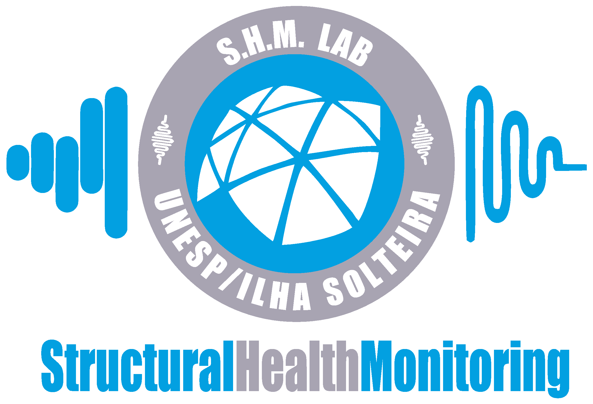

## ElasticityPINN


**ElasticityPINN** is a ...

### Table of Contents
- [Overview](#overview)
- [Usage](#usage)
- [Documentation](#documentation)
- [Authors](#authors)
- [Citing ElasticityPINN](#citing-elasticitypinn)
- [License](#license)
- [Institutional support](#institutional-support)
- [Funding](#funding)
- [Contact](#contact)

### Overview
**ElasticityPINN** was developed to ...

### Usage
To get started with **ElasticityPINN**, follow these steps:
1. Clone the repository:
   ```bash
   git clone https://github.com/estevaofuzaro98/ElasticityPINN.git
   ```
2. Navigate to the package directory:
   ```bash
   cd ElasticityPINN
   ```

### Documentation
The routines in **ElasticityPINN** are well-commented to explain their functionality. The main routine was coded in `Python Notebook` within useful comments along the cells.......

### Authors
- Estevão Fuzaro de Almeida
- Samuel da Silva

### Citing ElasticityPINN
If you use **ElasticityPINN** in your research, please cite the following publication:
- *E. F. Almeida, S. Silva, Some Regards on using Physics-Informed Neural Networks for Solving Two-Dimensional Elasticity Problems, Journal of the Brazilian Society of Mechanical Sciences and Engineering, 2025 http://dx.doi.org/10.000/doi2bedefined*

```
@article{Almeida2025,
   author       = {E. F. Almeida and S. Silva},
   title        = {Some Regards on using Physics-Informed Neural Networks for Solving Two-Dimensional Elasticity Problems},
   year         = {2025},
   journal      = {Journal of the Brazilian Society of Mechanical Sciences and Engineering},
   volume.      = {XX},
   pages        = {XXXXX},
   note         = {10.000/doi2bedefined},
}
```

### License

**ElasticityPINN** is released under the MIT license. See the LICENSE file for details. All new contributions must be made under the MIT license.

 

### Institutional support

 &nbsp; &nbsp; 

### Funding


- São Paulo Research Foundation (FAPESP), grant number 2022/16156-9
- National Council for Scientific and Technological Development (CNPq/Brazil), grant number 309467/2023-3
- National Institute of Science and Technology, Smart Structures in Engineering (INCT-EIE)
   - Funded by the Brazilian agencies:
      -  CNPq, grant number 406148/2022-8
      -  Coordination for the Improvement of Higher Education Personnel (CAPES)
      -  Minas Gerais State Research Support Foundation (FAPEMIG)

### Contact
For any questions or further information, please contact the authors at:

- Estevão Fuzaro de Almeida: estevao.fuzaro@unesp.br
- Samuel da Silva: samuel.silva13@unesp.br
